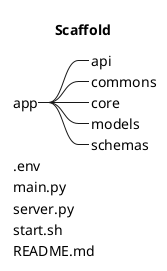

# Zayta

FastAPI Project template.

## Project Scaffolding



----

* app
  * root folder
* api
  * endpoint will sit there
* commons
  * The most commons, utils and helper stuffs will be here
  * auth stuff
  * config stuff
  * utils
* core
  * acctual implementatioin/fullfillment function of every single endpoint
  * e.g odoo, kore,...
* models
  * Pydantic basemodel for various use case.
* schemas
  * Representation of database schemes/tables

## Authentication Mechanism

```plantuml
title Hight Level Mechansim
start
    :Client call to an Endpoint;
    if (Authenticated? or token is not expiry yet) is (Yes) then
        :Continue...;
    else (No)
        :Login to Odoo;
        note
            If not auth yet or token is already expiried
            system will response the Unauthorized error.
            so client need to authenticate again.
        end note
        if (Success?) is (Yes) then
            :Generate JWT token;
            note
                With odoo uid and expiry time
                sub=uid
                exp=expiry_time
            end note
        else (No)
            :Response Unauthorized error;
        end if
    end if
end
```
